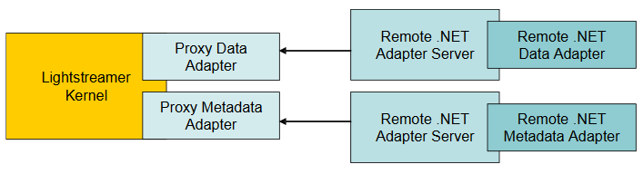

# Lightstreamer .Net Remote Adapter SDK

This project includes the source code of the Lightstreamer .Net Remote Adapter. This resource is needed to develop Remote Data Adapters and Remote Metadata Adapters for [Lightstreamer Server](http://www.lightstreamer.com/) in a .NET environment.

Each Lightstreamer session requires the presence of an Adapter Set, which is made up of one Metadata Adapter and one or multiple Data Adapters. Multiple Adapter Sets can be plugged onto Lightstreamer Server.
The adapters will run in a separate process, communicating with the Server through the Proxy Adapters.

This SDK is designed for .NET Standard API Specifications 2.0 and greater.
The .NET Standard allows greater uniformity through the .NET ecosystem and works seamlessly with .NET Core, .NET Framework, Mono, Unity, Xamarin and UWP apps. 

## Building ##

To build the library, follow below steps:

1. Create a new Visual Studio project (we used Visual Studio 2019) for `Class Library (.NET Standard)`
2. Remove auto created class.cs source file
3. Add all the existing resources contained in the `DotNetStandardAdapter` folder
4. Add NuGet references for:
	- System.Configuration.ConfigurationManager
5. Build the project

## Compatibility ##

The library is compatible with [Adapter Remoting Infrastructure](https://lightstreamer.com/docs/adapter_generic_base/ARI%20Protocol.pdf) since version 1.8.x.

## External Links

- [NuGet package](https://www.nuget.org/packages/Lightstreamer.DotNetStandard.Adapters/)

- [Examples](https://demos.lightstreamer.com/?p=lightstreamer&t=adapter&ladapter=dotnet_adapter)

- [API Reference](https://lightstreamer.com/api/ls-dotnetstandard-adapter/latest/)

## Other GitHub Projects Using this Library

- [Lightstreamer - Reusable Metadata Adapters - .NET Adapter](https://github.com/Lightstreamer/Lightstreamer-example-ReusableMetadata-adapter-dotnet)

## Support

For questions and support please use the [Official Forum](https://forums.lightstreamer.com/). The issue list of this page is **exclusively** for bug reports and feature requests.

## License

[Apache 2.0](https://opensource.org/licenses/Apache-2.0)
