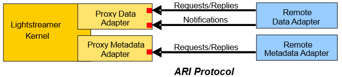

# Lightstreamer .Net Remote Adapter SDK

This project includes the source code of the Lightstreamer .Net Remote Adapter. This resource is needed to develop Remote Data Adapters and Remote Metadata Adapters for [Lightstreamer Server](http://www.lightstreamer.com/) in a .NET environment.

Each Lightstreamer session requires the presence of an Adapter Set, which is made up of one Metadata Adapter and one or multiple Data Adapters. Multiple Adapter Sets can be plugged onto Lightstreamer Server.
The adapters will run in a separate process, communicating with the Server through corresponding `Proxy Adapters` embedded in the Lightstreamer server.

This SDK is designed for .NET Standard API Specifications 2.0 and greater.
The .NET Standard allows greater uniformity through the .NET ecosystem and works seamlessly with .NET Core, .NET Framework, Mono, Unity, Xamarin and UWP apps.

### The ARI Architecture

Lightstreamer Server exposes native Java Adapter interfaces. The .NET interfaces are added through the [Lightstreamer Adapter Remoting Infrastructure (**ARI**)](https://lightstreamer.com/docs/ls-server/latest/Adapter%20Remoting%20Infrastructure.pdf). 

ARI is simply made up of two types of Proxy Adapters and a *Network Protocol*. The two Proxy Adapters, one implementing the Data Adapter interface and the other implementing the Metadata Adapter interface, are meant to be plugged into Lightstreamer Kernel.

Basically, a Proxy Adapter exposes the Adapter interface through TCP sockets. In other words, it offers a Network Protocol, which any remote counterpart can implement to behave as a Lightstreamer Data Adapter or Metadata Adapter. This means you can write a remote Adapter in any language, provided that you have access to plain TCP sockets.
But, if your remote Adapter is based on certain languages/technologies (such as Java, .NET, and Node.js), you can forget about direct socket programming, and leverage a ready-made library that exposes a higher level interface. Now, you will simply have to implement this higher level interface. 

In this specific project we provide the full source code that makes up the <b>Lightstreamer .NET Standard Adapter API</b> library.
So, let's recap... the Proxy Adapter converts from a Java interface to TCP sockets, and the .NET Standard library converts from TCP sockets to a .NET interface.

## Building

To build the library, follow below steps:

1. Create a new Visual Studio project (we used Visual Studio 2019) for `Class Library (.NET Standard)`
2. Remove auto created class.cs source file
3. Add all the existing resources contained in the `DotNetStandardAdapter` folder
4. Add NuGet references for:
	- System.Configuration.ConfigurationManager (>= 4.7.0)
5. Build the project

### LiteralBasedProvider

This project includes a simple full implementation of Remote Metadata Adapter in C# made available as sample for inspiration and/or extension.

The [LiteralBasedProvider](https://github.com/Lightstreamer/Lightstreamer-lib-adapter-dotnet-remote/tree/master/DotNetStandardAdapter/Source_Generic_Adapters) is the .NET Remote equivalent of the *LiteralBasedProvider* Metadata Adapter in [Lightstreamer Java In-Process Adapter SDK](https://github.com/Lightstreamer/Lightstreamer-lib-adapter-java-inprocess#literalbasedprovider-metadata-adapter).
It extends the [MetadataProviderAdapter](https://lightstreamer.com/api/ls-dotnetstandard-adapter/latest/api/Lightstreamer.Interfaces.Metadata.MetadataProviderAdapter.html) abstract class (which in turn implements the [IMetadataProvider](https://lightstreamer.com/api/ls-dotnetstandard-adapter/latest/api/Lightstreamer.Interfaces.Metadata.IMetadataProvider.html) interface).
It is used in Lightstreamer examples and demos based on the .NET Remote Adapter SDK, in combination with suitable Data Adapters and Clients.

The LiteralBasedProvider can be configured through suitable initialization parameters. See the [class documentation](https://lightstreamer.com/api/ls-dotnetstandard-adapter/latest/api/Lightstreamer.Adapters.Metadata.LiteralBasedProvider.html) for details.

## Compatibility

The library is compatible with Adapter Remoting Infrastructure since Server version 7.4.

For a version of this library compatible with earlier versions of Lightstreamer Server see [this tag](https://github.com/Lightstreamer/Lightstreamer-lib-adapter-dotnet-remote/tree/v1.14.3).

Full changelog: [CHANGELOG.md](https://github.com/Lightstreamer/Lightstreamer-lib-adapter-dotnet-remote/blob/master/CHANGELOG.md)

## External Links

- [NuGet package](https://www.nuget.org/packages/Lightstreamer.DotNetStandard.Adapters/)

- [Examples](https://demos.lightstreamer.com/?p=lightstreamer&t=adapter&ladapter=dotnet_adapter)

- [API Reference](https://lightstreamer.com/api/ls-dotnetstandard-adapter/latest/index.html)

- [Adapter Remoting Infrastructure Network Protocol Specification](https://lightstreamer.com/api/ls-generic-adapter/latest/ARI%20Protocol.pdf)

## Other GitHub Projects Using this Library

- [Lightstreamer - "Hello World" Tutorial - .NET Adapter](https://github.com/Lightstreamer/Lightstreamer-example-HelloWorld-adapter-dotnet)
- [Lightstreamer - Stock-List Demo - .NET Adapter](https://github.com/Lightstreamer/Lightstreamer-example-Stocklist-adapter-dotnet)
- [Lightstreamer - Portfolio Demo - .NET Adapter](https://github.com/Lightstreamer/Lightstreamer-example-Portfolio-adapter-dotnet)

## Support

For questions and support please use the [Official Forum](https://forums.lightstreamer.com/). The issue list of this page is **exclusively** for bug reports and feature requests.

## License

[Apache 2.0](https://opensource.org/licenses/Apache-2.0)
